# Introduction to Networking with LINUX PART-1
## 1 INTRODUCTION
When it comes to networking, there is probably nothing that cannot
be done with Linux.

Some one said once : Programming is learnt better with examples
rather than with theories and books. Here are commands explained
with example. But don’t rely only on this article. This is only
the insight into what can be done. See manual pages for more
information.
## 2 ping
**send ICMP ECHO REQUEST to network hosts**

ping is the most basic command. And it is by default installed in all linux sys-
tems. This can be used to check if your internet connection is working properly.

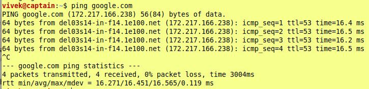

**Figure 2.1**

It verifies the connection by sending packets of data. Use ctrl-C to stop it
otherwise it will keep sending data. In the end it provides a brief summary of
what has been done. It sends 1 packet each second by default. here you can see
172.217.166.238 is the exact IP address of server. It also provides the length of
time taken to return data.

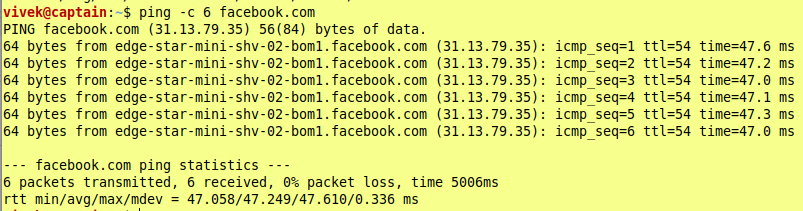

**Figure 2.2**

Flag *-c* **n** specifies exactly n number of packets to send.
Afterwards the command auto stops.

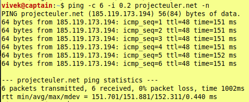

**Figure 2.3**

Flag *-i* **n** specifies exactly n seconds wait before sending next packet.
And Flag *-n* says to print only numeric outputs.
As manual says: only superuser can set interval less than 0.2 .

There even more options, like you can set a deadline time for ping to stop
with *-w* **deadline**.
Default packet size is 55 but you can change it with *-s* **packetsize**.
#### NOTE :-
> Some network devices are configured to ignore these packets for security reasons.
  Even some firewalls are configured to block ICMP traffic.

> example site : w3schools.com .

> "ping w3schools.com" will fail to recieve any packets .

## 3 ifconfig
**configure a network interface**

Ifconfig  is used to configure the kernel-resident network interfaces.
It is used at boot time to set up interfaces as necessary.
After that, it is usually only needed when debugging or 
when system  tuning  is needed.

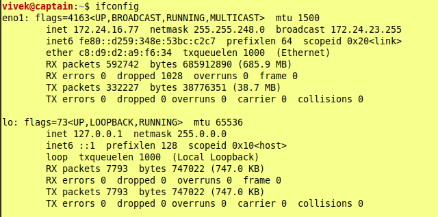

**Figure 3.1**

If no arguments are given,
ifconfig displays the status of the currently active interfaces. 
If a single interface argument is given,
it displays the status of the given interface only.

**Figure 3.2**
    
Using grep to see a specific result.
Here I show data uses by the Ethernet Interface.
RX is recieved amount of data and TX is transfered data since last login.

## 4 traceroute
**print the route packets trace to network host**

Trace every server that request jumps from or to in order to get to the host server.

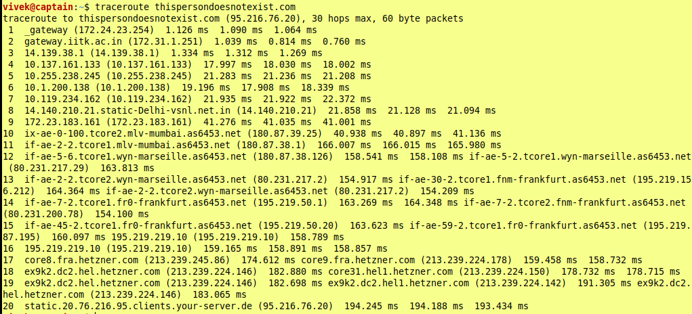

**Figure 4.1**
    
We see asterisks in the line when router do not provide identifying information.
In cases where routing information is blocked, we can sometimes overcome this by adding
either the -T or -I option to the traceroute command.

## 5 ip
**show / manipulate routing, network devices, interfaces and tunnels**

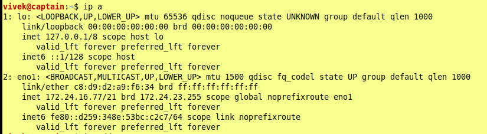

**Figure 5.1**
    
'a' is sort for address.
In my case we see only 2 interfaces.
The first called $lo$ is the loopback interface, using this our system talks to itself.
Second one $eno1$ is the ethernet interface.
I don't have a wireless driver right now, 
but if you do , you will see another wireless interface named $wlo0$ or $wlo1$.
All these listed commands will do the same thing.

    vivek@captain:~$ ip a
    vivek@captain:~$ ip addr
    vivek@captain:~$ ip address

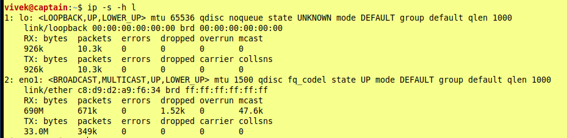

**Figure 5.2**
    
*-s* flag outputs more information, which is statistics or time value.
*-h* flag makes it more human readable.
In output RX is recieved data and TX is Transmitted data.

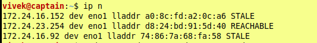

**Figure 5.3**

Address Resolution Protocol (ARP) is used to translate an IP address 
to its corresponding physical address, commonly known as MAC address.
With ip command you can view the MAC address of the devices connected
in your LAN by using the option neigh or neighbour or simply n.

You can activate or deactivate a network interface by:\\

    $ sudo ip link set <interface> up

or

    $ sudo ip link set <interface> down

## 6 tcpdump
**dump traffic on a network**

tcpdump is one of my favourite commands here.
This program sees everything going out or coming to your system.
tcp is transmission control protocol.

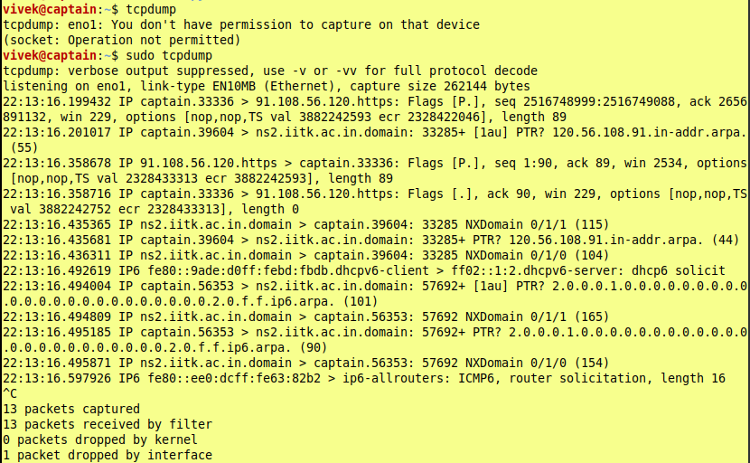

**Figure 6.1**

tcpdump may require sudo privilege to run, as you can see in figure 6.1
that I had to use sudo tcpdump.
This command 'without any option' Listens on every port and keeps running 
forever.
Use ctrl-C to stop.
Afterwards it shows a brief summary.
**'packets dropped by interface'** is a coincidence.
It was capturing a packet when I stoped it.
That's why it shows 1 packet dropped by interface.
**'packets dropped by kernel'** is the buffer overflow.
The incoming packets to tcpdump are buffered (queued) for processing.
Sometimes there are too many packets in the buffer, and buffer runs out of memory.
So further packets are dropped till some memory is freed.

You can increase the buffer size with the -B (--buffer-size) option like this:

    $ tcpdump -B 4096 

Note that the size is specified in kilobytes,
so the line above sets the buffer size to 4MB.

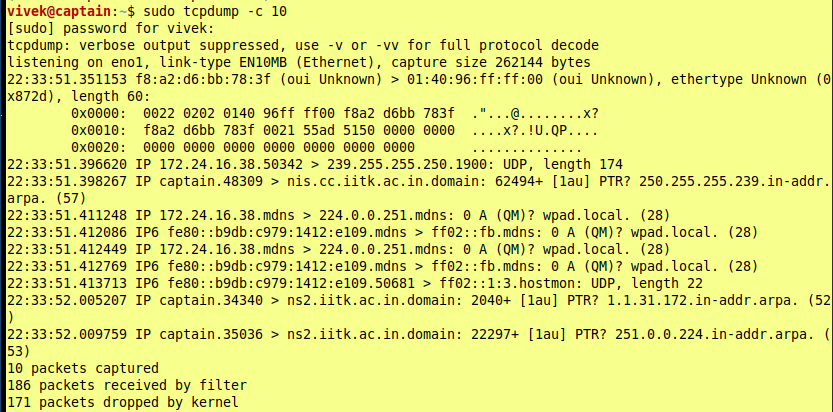

**Figure 6.2**

*-c* flag specifies the exact number of packets to process.

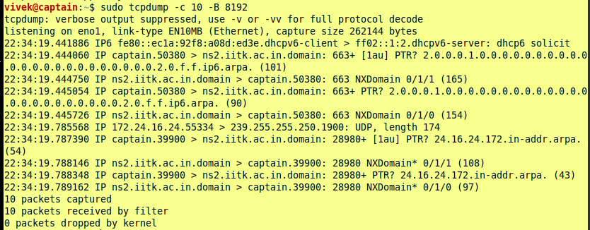

**Figure 6.3**

Compared to figure 6.2, 
We can see that after increasing the buffer size no packets are dropped by kernel.

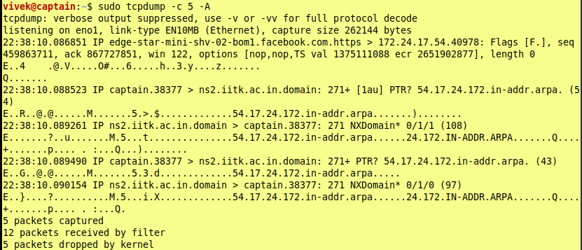

**Figure 6.4**

*-A* flag tells the program to catenate the packets on standard output 
as ascii characters.

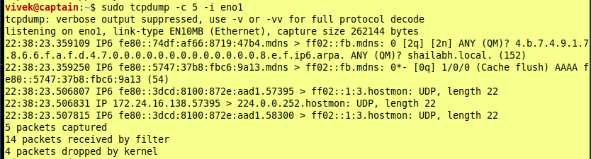

**Figure 6.5**

You can specify a network interface to look for with *-i <interface>* flag.

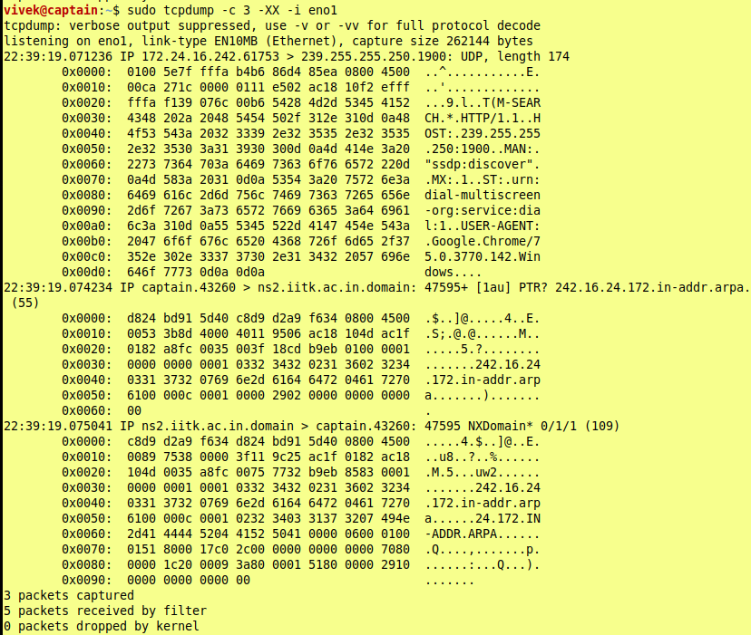

**Figure 6.6**

*-XX* flag tells the program to catenate the packets in hex as well as in ascii
on standard output.

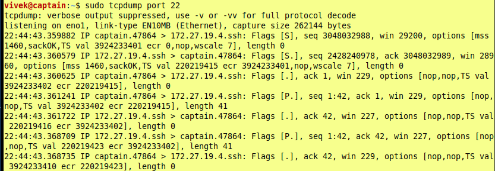

**Figure 6.7**

You can also specify a port to look for with *port <port number>*.
Use ctrl-C to exit.
Here a look on port 22 (special port for ssh).
But if you are not using this port, you will not see any output packets here.

One more thing to consider/try is that tcpdump may be spending a lot of time
doing DNS queries to resolve IPs to domain names.
If you don't need those, try throwing in the -n (no lookups) flag.
This will speedup your work. e.g.:

    $ tcpdump -n port 80

There are much more to this command than what I have shown you.
Keep tinkering to find more.

These days with increasing power of processors and security, 
almost all programs send and recieve encrypted packets.
It's not easy to decrypt a messages, and get something like a password
out of it.
For new people the above results of the tcpdump command has no much use.
Therefore it's mainly used for troubleshooting network activities.

## 7 netstat
**Print network connections, routing tables,
interface statistics, masquerade connections, and multicast memberships**

Netstat  prints  information  about the Linux networking subsystem. 
The type of information printed is controlled by the first argument.
Here are few examples.

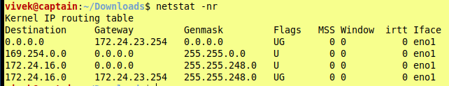

**Figure 7.1**

*-r* flag specifies kernel IP table.
*-n* for numerical IP address instead of domain names.

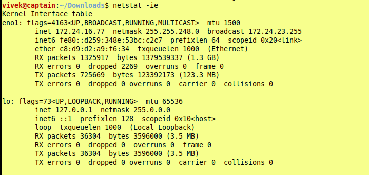

**Figure 7.2**

*-i* flag gives uses of each of our device.
*-e* flag gives extended result.

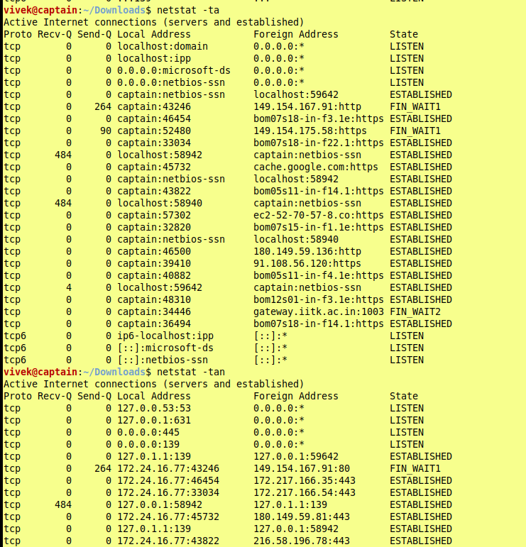

**Figure 7.3**

flag *-ta* shows all ports using tcp protocol,
the local address and connected foreign address.

#### NOTE :-
> This program is mostly obsolete.

> Replacement for netstat is ss. 

> Replacement for netstat -r is ip route. 

> Replacement for netstat -i is ip -s link. 

> Replacement for netstat -g is ip maddr.

## 8 ss
**an utility to investigate sockets**

It can display more TCP and state information than other tools.
With no option it displays a list of open non-listening sockets.

**Figure 8.1**

This result would have been nasty.
*wc -l* only counts the number of lines and prints it.

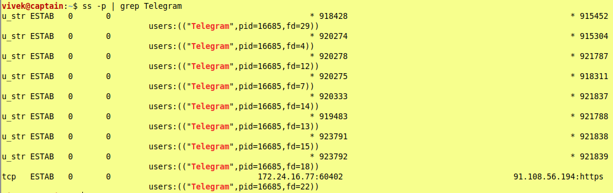

**Figure 8.2**

With *-p* option it shows processes using the sockets.
This result was really big.
I only grepped The sockets used by Telegram.

With *-K* option you can attempt forcibly close a socket.

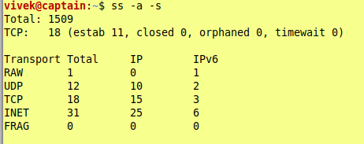

**Figure 8.2**

By default ss only displays listening sockets,
but with *-a* option it will display all listening and non-listening.
*-s* option is good if you just want a summary of result.

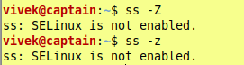

**Figure 8.4**

*-Z* option is same as *-p* but it also displays process security information
*-z* option is same as *-Z* but also includes socket context.
Oh, but here it says "SELinux is not enabled".
On most systems 'selinux-utils' is not installed.
It enhances the security of your system if you wish to use it as server.
If not installed you can install it with command:

    $ sudo apt install selinux-utils
on debian based systems.
But be warned It might crush your system, so better ask someone before installing.
    
## 9 iw
**show / manipulate wireless devices and their configuration**

Take a look at manual page.
Coming Soon from my side.

Or just type "iw" in terminal and you will see a lot of options.

## 10 whois
**client for the whois directory service**

The WHOIS is a query/response protocol that is widely used to query databases
that hold information about internet resources such as domain names
and IP address allocations.
whois searches for an object in a RFC 3912 database.

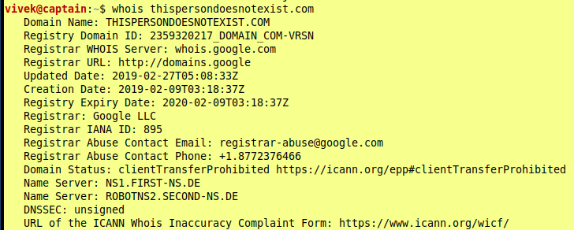

**Figure 10.1**

## 11 nmap
**Network exploration tool and security / port scanner**

nmap ("network mapper") is an open source tool for network exploration and security auditing.
It was designed to rapidly scan large networks, and can also be used against a single host.
In addition to the interesting ports table, Nmap can provide further information on targets,
including reverse DNS names, operating system guesses, device types, MAC addresses
application name and version.

This command has been used in two of the modern movies:

    Elysium (2013),
    G.I. Joe: Retaliation (2013).

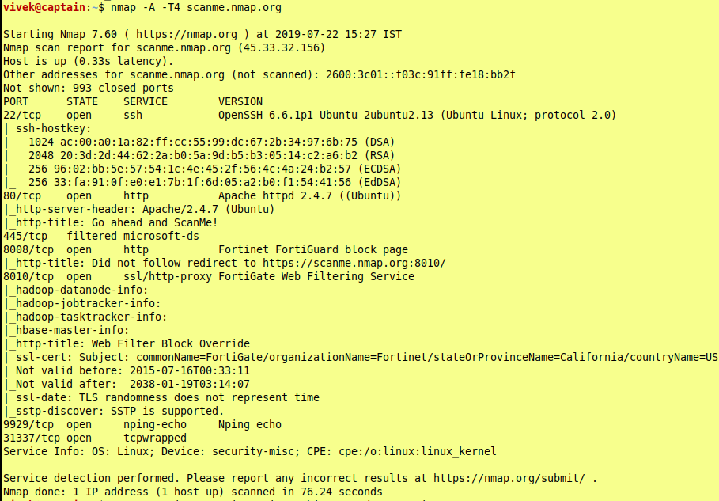

**Figure 11.1**

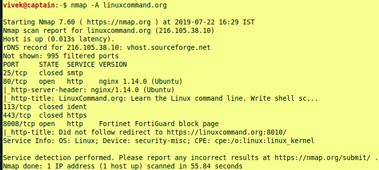

**Figure 11.2**

flag *-A* provides more information, like os version.
flag *-T4* makes work faster.

We will discus about this command again, 
later in network exploitation.
We will take a deep dive later.

## 12 conclusion
If you are Interested in networking with linux, then for you Things are just getting started.
These simple commands have a supporting role in actual networking.
On diving deeper You will find much more interresting things.
You will be able to write your own scripts.
Scripts strong enough to download full data base of a server.
Some of the funny parts include hacking wifi passwords,
making a server down, Creating your own cypher chatting protocol, etc.\\

## 13 further reading

[linuxcommand.org](http://linuxcommand.org/)

A well organised website to get started with linux.
Also Bash-Scripting.

[linux-training.be](http://linux-training.be/)

Comtains a series of 6 books till now.
from very fundamentals of linux to Administration, Servers, Security and Networking.

[DNS](https://en.wikipedia.org/wiki/Domain_Name_System)

Learn about Domain Name System (DNS) from wikipedia.

[DHCP](https://en.wikipedia.org/wiki/Dynamic_Host_Configuration_Protocol)

Learn about Dynamic Host Configuration Protocol (dhcp) .

[TCP](https://en.wikipedia.org/wiki/Transmission_Control_Protocol)

Learn about one of the main protocols of the internet protocol suite
Transmission Control Protocol (tcp).

[URL](https://en.wikipedia.org/wiki/URL)

Learn about Uniform Resource Locator (URL).

[IPv4](https://en.wikipedia.org/wiki/IPv4)

Learn about one of the core protocols of standards-based
internetworking methods in the Internet. 
The Fourth version of the Internet Protocol (IP) 
which still routes most Internet traffic today.

[ICMP](https://en.wikipedia.org/wiki/Internet_Control_Message_Protocol)

Learn about Internet Control Message Protocol (ICMP) 
a supporting protocol in internet protocol suite.
[nmap](https://nmap.org)
Oficial Website of nmap.
A lot more than the manual.
Also there a is a book about nmap.

## 14 The Post Credit Scene
If you liked this blog, You are definitely going to like my upcoming blogs in this series.
There we will talk about how to connect to a server , how to download from or upload data
to a server.  
We will learn to create our own server, and to maintain it.
We will learn to share data between computers using Terminal.
etc..etc.. A lot to come.
stay tunned.

If you find anything wrong or you have any sugestions.
Mail me at vivekkumargupta680@gmail.com .
I would love to hear from you.
